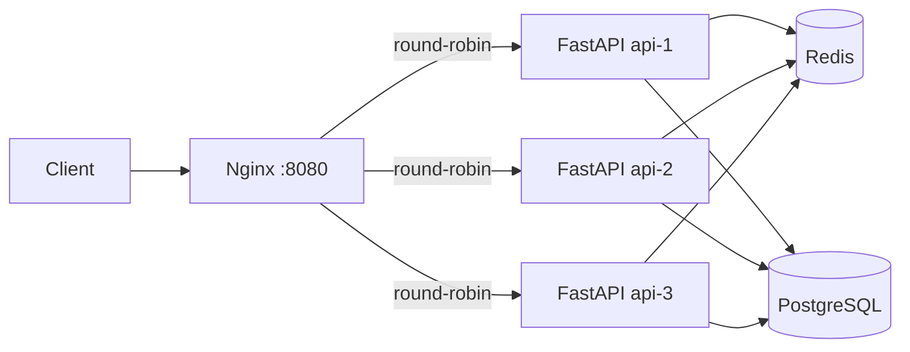

# Scalable URL Shortener

A URL shortener built with FastAPI, PostgreSQL, and Redis, containerized with
Docker and served through an Nginx reverse proxy. Horizontally scaled to 3 API
instances and load-tested with Locust. Built as a learning project to practice
async APIs, caching, rate limiting, and stress testing.

## Architecture



- **API:** FastAPI on uvicorn (async), 3 instances behind Nginx
- **Database:** PostgreSQL 15 via `asyncpg` connection pool
- **Cache:** Redis 7 as a cache-aside layer for reads and rate-limit state
- **Proxy:** Nginx using Docker's embedded DNS (`127.0.0.11`) with a variable in `proxy_pass` to re-resolve the `api` hostname per request — this enables real round-robin across scaled containers
- **Containerization:** Docker Compose

## Endpoints

| Method | Path | Description |
|---|---|---|
| GET | `/` | Health check. Returns hostname, DB/Redis status. |
| POST | `/shorten` | Body: `{"url": "https://..."}`. Returns short URL. |
| GET | `/{short_code}` | Redirects (307) to original URL, or 404. |

Interactive docs at `/docs`.

## Features

- **Cache-aside redirects:** `GET /{short_code}` checks Redis first; on miss, queries PostgreSQL and caches the result for 10 minutes.
- **IP-based rate limiting:** `POST /shorten` uses Redis `INCR` + `EXPIRE` — atomic, O(1), capped at 5 requests per minute per IP.
- **Collision-resistant codes:** 6-character codes from `[A-Za-z0-9]` using `secrets.choice`. Insert retries on PostgreSQL `UniqueViolationError`.
- **Async connection pooling:** `asyncpg` pool reused across requests via FastAPI `lifespan`.
- **Race-safe schema creation:** API containers handle concurrent `CREATE TABLE IF NOT EXISTS` via try/except on `DuplicateTableError`.
## Load Testing Results

Tested with **Locust** against `GET /`. Windows host, AMD Ryzen 5 5600H, 24 GB RAM. All containers on the same machine.

| Users | RPS | Failures | Failure Rate | Median | 95%ile | Verdict |
|---|---|---|---|---|---|---|
| 200 | 647 | 0 | 0% | 5 ms | 17 ms | ✅ Clean |
| 500 | 934 | 294 | 0.4% | 110 ms | 16 s | ⚠️ Peak |
| 1000 | 685 | 485 | 1.3% | 200 ms | 16 s | ❌ Degrading |
| 2000 | 662 | 6,776 | 15% | 230 ms | 20 s | ❌ Saturated |
| 5000 | 714 | 12,190 | 27% | 230 ms | 21 s | ❌ Dead |

**Peak clean run:** 200 users — 647 RPS, 0 failures, 5 ms median.
**Peak stressed run:** 500 users — 934 RPS, before Windows loopback port exhaustion.

### Failure analysis

Above ~500 users, failures appear. Breaking them down:

- **`ConnectionAbortedError 10053`** (~85%) — Windows killed the socket. Caused by ephemeral port exhaustion because Locust and the Docker containers compete for ports on the same loopback adapter.
- **`RemoteDisconnected`** (~14%) — connection closed while waiting for a response, likely from event-loop congestion and page-file swapping under memory pressure.
- **`ConnectionResetError 10054`** (~1%) — same root cause as above.

**Zero `500 Internal Server Error` from the application** across all runs. All failures are environmental (Windows host limits), not application bugs.

On a real Linux host with separate client and server machines, these failures would not occur, and the ceiling would be determined by the API containers rather than the load generator.
 
## Project Commands

```bash
# Start the system with 3 API containers
docker-compose up --build -d --scale api=3

# Shut down the system
docker-compose down

# View live API logs
docker-compose logs -f api

# View live Nginx logs
docker-compose logs -f nginx

# Open PostgreSQL shell
docker-compose exec db psql -U postgres -d url_db

# Start Locust load test (GUI at http://localhost:8089)
python -m locust -f locustfile.py --host=http://localhost:8080
```